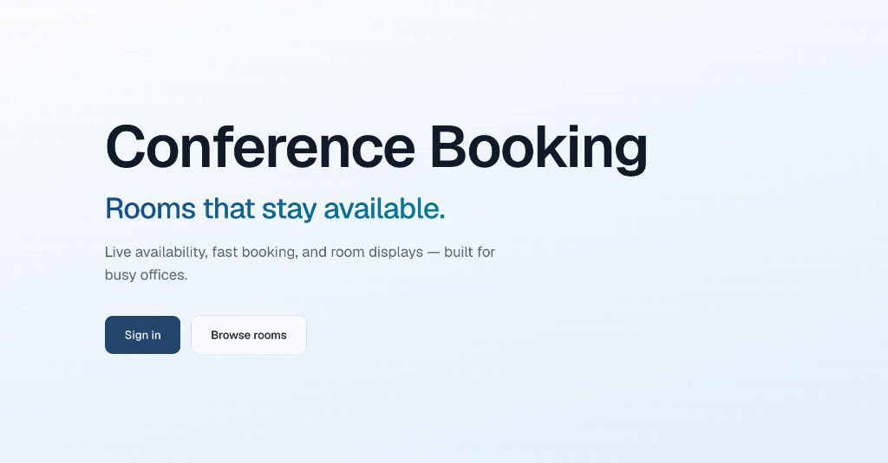
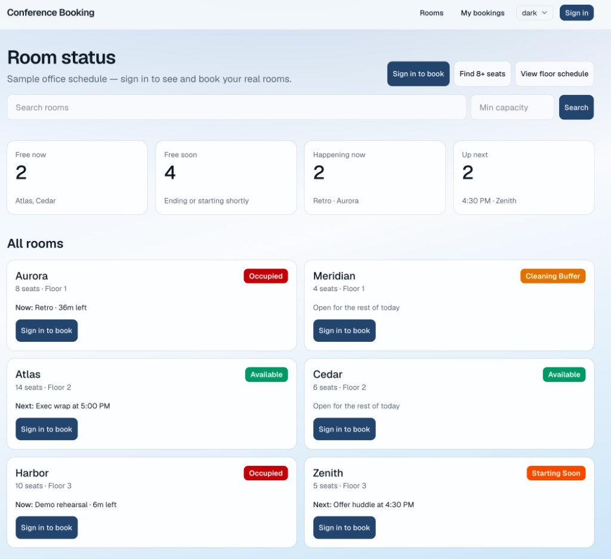

# Conference Booking

A deployable, multi-tenant conference-room booking SaaS with three surfaces sharing one Next.js backend:

1. **User portal** — live availability, search, booking management, and QR room pages
2. **Workspace admin** — rooms, bookings, members, billing, promo codes, devices, QR codes, and settings
3. **Room display (kiosk)** — a locked-down fullscreen tablet UI at `/display/{deviceToken}`





Guests browsing `/rooms` see a preset sample office schedule. Real workspace data remains isolated behind sign-in, while public room and QR URLs can be shared directly.

## What is included

- Self-service signup with organization onboarding and Owner membership
- Passwordless Auth.js magic links through Resend, with a console fallback in development
- Organization-scoped rooms, bookings, members, invitations, devices, and settings
- Room availability, cleaning buffers, starting-soon states, and conflict prevention
- Booking creation, editing, cancellation, and post-login booking resume
- Email invitations with expiring accept links and role selection
- Free and Pro plans with server-side room-limit enforcement
- Stripe Checkout, Customer Portal, webhook synchronization, and local sync fallback
- Free-month, percentage-off, and fixed-amount promo codes
- Tablet registration, room assignment, heartbeat status, QR pairing, and kiosk exit/recovery
- Responsive light/dark themes, CI checks, and production-ready database migrations

## Stack

- Next.js 16 App Router + React 19 + TypeScript
- Prisma 6 + PostgreSQL 16
- Auth.js 5 + Resend magic links
- Stripe subscriptions, Checkout, Customer Portal, and webhooks
- Tailwind CSS 4 + shadcn/ui
- Vitest + ESLint + GitHub Actions

## Quick start

```bash
# 1. Install and configure
npm install
cp .env.example .env

# 2. Database
docker compose up -d
npx prisma migrate deploy
npm run db:seed

# 3. App
npm run dev
```

Open [http://localhost:3000](http://localhost:3000).

### Seed accounts

| Email | Role |
|-------|------|
| `admin@example.com` | Owner (admin) |
| `member@example.com` | Member |

Magic links print to the **dev server console** when `AUTH_RESEND_KEY` is empty.
The seed also creates:

- Demo rooms at `/rooms/orion`, `/rooms/nova`, and `/rooms/helios`
- A kiosk at `/display/demo-orion-kiosk`
- Promo code `DEMO3MO`, which grants three months of Pro

## SaaS plans

- **Free** — up to 2 rooms per organization (default on signup at `/signup`)
- **Pro** — up to the practical 500-room safety cap via Stripe Checkout or a free-month promo
- Orgs are isolated: rooms, bookings, devices, and members stay inside one workspace
- Owners and admins invite teammates from **Admin → Users**
- Plan checks are enforced on the server, not only hidden in the UI
- Active Stripe subscriptions and unexpired promos are treated as Pro everywhere

Set `PLATFORM_OWNER_EMAILS` to your operator email(s) to expose **Admin → Promo codes**. Free-month codes grant Pro immediately without requiring Stripe; percentage and fixed-amount codes are created in Stripe and attached to Checkout.

## Deploy with Stripe

The app needs one Node.js service and one PostgreSQL database. It works on any host that supports a Next.js server, persistent environment variables, and outbound HTTPS.

### 1. Deploy the app

Create a PostgreSQL database, deploy this repository, and add:

```env
DATABASE_URL=postgresql://...
AUTH_SECRET=generate-a-long-random-value
AUTH_URL=https://booking.example.com
NEXT_PUBLIC_APP_URL=https://booking.example.com

AUTH_RESEND_KEY=re_...
EMAIL_FROM=Conference Booking <booking@example.com>
PLATFORM_OWNER_EMAILS=owner@example.com
```

Use the standard commands:

```bash
npm install
npm run build
npm start
```

`npm start` runs `prisma migrate deploy` before starting Next.js, so committed migrations are applied automatically on each deployment.

### 2. Add Stripe

In Stripe test mode:

1. Create a Product such as **Conference Booking Pro**.
2. Add a recurring monthly or yearly Price.
3. Copy the secret key and `price_...` ID into the deployment environment:

```env
STRIPE_SECRET_KEY=sk_test_...
STRIPE_PRICE_ID=price_...
NEXT_PUBLIC_STRIPE_PUBLISHABLE_KEY=pk_test_...
```

4. Create a webhook endpoint at:

```text
https://booking.example.com/api/stripe/webhook
```

5. Subscribe it to:
   - `checkout.session.completed`
   - `customer.subscription.updated`
   - `customer.subscription.deleted`
   - `invoice.paid`
   - `invoice.payment_failed`
6. Copy its signing secret into:

```env
STRIPE_WEBHOOK_SECRET=whsec_...
```

Redeploy or restart once after changing environment variables. That is enough to enable **Upgrade to Pro** and **Manage subscription** under **Admin → Billing**. Checkout metadata associates the Stripe customer and subscription with the correct organization, and webhooks keep its entitlement synchronized.

### Local Stripe testing

Install the [Stripe CLI](https://docs.stripe.com/stripe-cli), then run this beside `npm run dev`:

```bash
stripe login
stripe listen --forward-to localhost:3000/api/stripe/webhook
```

Copy the printed `whsec_...` into `STRIPE_WEBHOOK_SECRET` and restart the dev server. The billing page also performs a safe Stripe sync after Checkout, which makes local testing resilient when a webhook was missed.

Keep test keys in local/deployment secrets only. Never commit `.env` or live Stripe keys.

## Authentication and invitations

- `/signup` captures the workspace name, sends a magic link, and completes onboarding after authentication.
- Existing users sign in at `/login`; development magic links are printed when Resend is not configured.
- Invitations are sent as HTML and plain text, expire after 14 days, and can only be accepted by the invited email.
- Pending invites display their accept link in **Admin → Users**, providing a fallback when email delivery is unavailable.

For production email, verify your sending domain in Resend and set `EMAIL_FROM` to an address on that domain.

## Useful URLs

- Landing: `/`
- Sign up: `/signup`
- Rooms dashboard: `/rooms`
- Room (QR): `/rooms/orion`
- Book: `/rooms/orion/book`
- Admin: `/admin` (after signing in as admin)
- Billing: `/admin/billing`
- Members and invites: `/admin/users`
- Tablet devices: `/admin/devices`
- Kiosk: `/display/demo-orion-kiosk`

Opening a display URL sets a short-lived `kiosk_device` cookie so that browser is limited to `/display/*` and `/api/kiosk/*`. Admin sessions are not trapped by this cookie, and invalid, disabled, or unassigned devices show a recovery screen with an exit option.

The kiosk lock is **defense-in-depth**. Production tablets should still use OS guided access or kiosk browser mode so users cannot clear cookies or leave the app.

## Scripts

| Script | Purpose |
|--------|---------|
| `npm run dev` | Dev server |
| `npm run lint` | ESLint |
| `npm run typecheck` | `tsc --noEmit` |
| `npm run test` | Vitest unit tests |
| `npm run test:watch` | Vitest watch mode |
| `npm run build` | Production build |
| `npm run db:migrate` | Prisma migrate |
| `npm run db:generate` | Generate Prisma client |
| `npm run db:push` | Push schema without a migration |
| `npm run db:seed` | Seed demo data |
| `npm run db:studio` | Open Prisma Studio |

## CI

GitHub Actions runs lint, typecheck, Prisma validate, and build on pushes/PRs to `main`.

## Project layout

```
src/
  app/           # routes (portal, admin, kiosk, api)
  features/      # auth, organizations, billing, rooms, bookings, devices, kiosks
  components/ui/ # shadcn primitives
  lib/           # db, auth, billing, tenancy, room status, utilities
prisma/          # schema + seed
docs/            # screenshots and product notes
```

## Production checklist

- Use a managed PostgreSQL database with backups.
- Set production `AUTH_SECRET`, `AUTH_URL`, and `NEXT_PUBLIC_APP_URL`.
- Verify the Resend sending domain and production `EMAIL_FROM`.
- Switch Stripe environment values from test to live mode.
- Create the live Stripe webhook and use its live signing secret.
- Keep all secrets in the hosting provider's environment manager.
- Run `npm run lint`, `npm run typecheck`, `npm run test`, and `npm run build`.
- Put room tablets in OS-level kiosk/guided-access mode.

Detailed local setup is in [`INSTALL.md`](INSTALL.md). Deferred work lives in [`docs/todo.md`](docs/todo.md).
